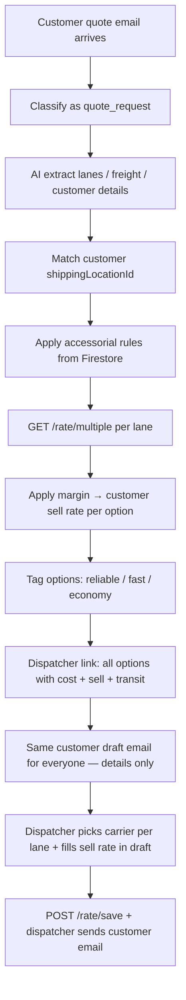

# Innovative — Quote Automation Reference

> **Purpose:** Single reference for the LTL quote automation project (email RFQ → extract shipment → apply accessorial rules → rate shop → save quote → respond).
>
> **Sources:** `alldocs` (Primus Swagger export), Primus email (Jul 2026), sandbox verification (`INNUSER` / `functions/scripts/primus-test-env.js`).
>
> **Swagger UI:** https://sandbox-api.shipprimus.com/api/v1/docs  
> Production: https://restapi.shipprimus.com/api/v1/docs

---

## 1. End-to-end workflow (approved build — Tier C + rules chatbot)



### Roles split

| Who | Gets what |
|-----|-----------|
| **System** | Rate shop, margin math, customer sell price per carrier option, one standard draft email with **shipment/lane details only** |
| **Dispatcher** | Link with options tagged (reliable / fast / etc.); picks what fits **this customer’s usual preference**; **fills chosen carrier + sell rate** into the draft before sending |

**Human in the loop:** System never auto-emails pricing to the customer. Dispatcher always chooses carrier and confirms the sell rate in the draft.

**Margin:** Applied automatically on every rate option (`cost` → `sell`). Dispatcher sees both; customer draft gets only what dispatcher enters.

**Rules management:** Dashboard + AI chatbot → propose rule changes → confirm → Firestore (see §17).

**No UI bridge (`manage.php`) required** for rate shop or save quote.

---

## 2. Authentication

All REST calls use Bearer token from login.

```
POST /api/v1/login
Content-Type: application/json

{ "username": "...", "password": "..." }

→ { "data": { "accessToken": "...", "exp": ... } }
```

**Sandbox (local probes only):** see `functions/scripts/primus-test-env.js` — forces `https://sandbox-api.shipprimus.com/api/v1`.

**Production:** `PRIMUS_BASE_URL` + `PRIMUS_USERNAME` / `PRIMUS_PASSWORD` in `.env.tai-invoice-automation`.

---

## 3. Email intake — fields to extract

Quote-request emails should be parsed into this structure before rating.

### 3.1 Parties

| Field | Description | Maps to rate query |
|-------|-------------|-------------------|
| `shipper.name` | Origin company | — |
| `shipper.address1`, `address2` | Street | — |
| `shipper.city` | **Required** | `originCity` |
| `shipper.state` | **Required** | `originState` |
| `shipper.zipCode` | **Required** | `originZipcode` |
| `shipper.country` | Default `USA` | `originCountry` |
| `shipper.contact`, `phone`, `email` | Optional | — |
| `consignee.*` | Same fields | `destinationCity/State/Zipcode/Country` |
| `thirdParty.*` | Bill-to customer when present | Used to match `shippingLocationId` |

### 3.2 Freight (`freightInfo` / `lineItems`)

Each row:

```json
{
  "qty": 1,
  "weight": 785,
  "weightType": "total",
  "class": 175,
  "length": 45,
  "width": 50,
  "height": 54,
  "dimType": "PLT",
  "commodity": "Novelties",
  "nmfc": "",
  "hazmat": false
}
```

| Field | Notes |
|-------|-------|
| `qty` | Piece count |
| `weight` | Pounds when `UOM=US` |
| `weightType` | `"total"` or `"each"` |
| `class` | NMFC freight class (required for LTL) |
| `length/width/height` | Inches; improves density/class |
| `dimType` | `PLT`, `BOX`, `CRT`, etc. |

Reference booking sample: `functions/scripts/booking-4170250.json`.

### 3.3 Customer identification

Match sender / bill-to from email to Primus shipping location:

1. Search by email domain or contact email
2. Search by company name (`name` query param)
3. Use returned `id` as `shippingLocationId` on rate call

---

## 4. Customer / shipping location database

**Official REST path:**

```
GET /api/v1/database/system/shippinglocation
GET /api/v1/database/system/shippinglocation/{id}
```

Legacy alias (some tenants): `GET /api/v1/database/shippinglocation`

### Query parameters

| Param | Example | Purpose |
|-------|---------|---------|
| `page` | `1` | Pagination |
| `limit` | `25` | Page size |
| `name` | `ABC` | Search by customer name |
| `code` | `CUST01` | Customer code |
| `active` | `true` | Active locations only |
| **`isCustomer`** | **`true`** | **Filter to bill-to customers only** |

### Response fields (key ones for quote automation)

| Field | Use |
|-------|-----|
| `id` | Pass as `customerId` on `/rate/multiple` |
| `name`, `code` | Customer match from email domain / company name |
| `email` | Match sender address directly |
| `customer` | `true` = valid bill-to customer |
| `customerReference` | PO / account ref |
| `billingInfo.termsId` | Payment terms (future) |

Use `results[].id` as **`customerId`** when calling `/rate/multiple` to apply
customer pricing profile (sell rate in `billTo` on each carrier option).

### Customer resolution flow (`resolveCustomerForQuote`)

1. Extract email domain from RFQ sender (`hannahs@ruelily.com` → `ruelily`)
2. `GET /database/system/shippinglocation?name=ruelily&isCustomer=true&active=true`
3. Pick best match: email match → `customer:true` → name match
4. Optional: `GET /database/system/shippinglocation/{id}` to validate profile
5. Optional: `GET /database/vendor/customer/{customerId}` for preferred carriers

---

## 4b. Saved cost quotes

After dispatcher picks a rate → `POST /rate/save` returns `costQuoteId`.

**Fetch full quote details:**

```
GET /api/v1/database/costquote/{costQuoteId}
```

| Field | Use |
|-------|-----|
| `quoteNumber` | Q# in customer email |
| `total` / `breakdown[]` | Final saved pricing |
| `vendor` | Carrier name, SCAC, transit, rateType |
| `accessorialsList[]` | What was included in saved quote |
| `url` | Primus document link |
| `BOLId` / `BOLNumber` | Set after booking |

**List quotes:**

```
GET /api/v1/database/costquote?dateFrom=YYYY-MM-DD&search=...
```

Use for quote history dashboard and carrier expiration follow-up.

---

## 4c. Customer carrier accounts

```
GET /api/v1/database/vendor/customer/{customerId}
```

Returns carriers configured for that customer (Averitt, Saia, etc.). Future use:
reliable-carrier tagging per customer profile.

---

## 4d. Phase 2 — Book from saved quote

When customer confirms, book via saved `costQuoteId`:

```
POST /api/v1/book
{
  "terms": "thirdParty",
  "thirdParty": { "id": "<customerId>" },
  "shipper": { "id": "<shipperLocationId>" },
  "consignee": { "id": "<consigneeLocationId>" },
  "vendorInformation": {
    "costQuoteId": 1234556
  },
  "lineItems": [...],
  "UOM": "US"
}
```

> When `vendorInformation.costQuoteId` is sent, carrier/pricing come from the
> saved quote — manual vendor entry not required.

### Pricing profiles (from `alldocs`)

```
GET  /api/v1/pricingprofile?id=&code=&name=&active=
POST /api/v1/pricingprofile
PUT  /api/v1/pricingprofile/{id}
```

Used for customer-specific carrier lists and markup rules attached to a profile.

---

## 5. Accessorial catalog (System)

**Verified REST path:**

```
GET /api/v1/accessorial
```

Returns full catalog:

```json
{
  "data": {
    "results": {
      "accessorials": [
        { "id": 1490071117, "code": "LFD", "name": "Liftgate in Destination", "category": "Destination" },
        { "id": 2019096527, "code": "LFO", "name": "Liftgate in Origin", "category": "Origin" },
        { "id": 2042113687, "code": "APD", "name": "Appointment at Destination", "category": "Destination" },
        { "id": 434126145,  "code": "APO", "name": "Appointment at Origin", "category": "Origin" }
      ]
    }
  }
}
```

Cache this list at startup or daily; rules engine resolves codes → `id` when needed.

### Passing accessorials to rate shop

**Official API** — repeated query param:

```
accessorialsList[]=LFD&accessorialsList[]=LFO
```

**With values (insurance, etc.):**

```
accessorialsWithData=[{"code":"LFD","value":1,"requireInput":false},{"code":"INS","value":16000,"requireInput":true}]
```

**Insurance example from production booking:**

```json
[{
  "code": "INS",
  "requireInput": true,
  "value": 16000,
  "addCost": false,
  "add10Per": false,
  "commodityInsur": "uuid",
  "coverTypeInsur": null
}]
```

Set `returnValidAccsOnly=true` to exclude carriers that cannot quote the
requested accessorials.

**Sandbox fallback:** Some dev tenants accept legacy `accessorials=["LFD"]`
JSON param. Set env `QUOTE_RATE_ACCESSORIAL_STYLE=json`.

**Standard + guaranteed:** `rateTypesList[]=LTL&rateTypesList[]=GUARANTEED`

---

## 6. Accessorial rules engine

Rules run **after** email extraction, **before** `/rate/multiple`. Output is merged into the `accessorials` / `accessorialsWithData` query params.

### 6.1 Rule format (to be filled in by Innovative)

```javascript
// functions/quote-accessorial-rules.js (planned)
const RULES = [
  {
    id: "amazon_fc_delivery",
    when: {
      consigneeNameMatch: /amazon(\.com)?|fba|amz/i,
    },
    addAccessorials: ["APD", "LAD"],
    notes: "Amazon FC — appointment delivery required",
  },
  {
    id: "residential_delivery",
    when: { flags: ["residentialDelivery"] },
    addAccessorials: ["RSD"],
  },
  {
    id: "liftgate_when_no_dock",
    when: { flags: ["noDock", "residentialPickup"] },
    addAccessorials: ["LFO"],
  },
  {
    id: "liftgate_dest_no_dock",
    when: { flags: ["noDock", "residentialDelivery"] },
    addAccessorials: ["LFD"],
  },
  {
    id: "school_delivery",
    when: { consigneeNameMatch: /school|academy|university/i },
    addAccessorials: ["SCD"],
  },
  {
    id: "insurance_default",
    when: { customerRequiresInsurance: true },
    addAccessorialsWithData: [{
      code: "INS",
      requireInput: true,
      value: "{{declaredValue}}",
    }],
  },
];
```

### 6.2 Common codes reference

| Code | Name | When to use |
|------|------|-------------|
| `APD` | Appointment at Destination | Amazon FC, scheduled delivery |
| `APO` | Appointment at Origin | Pickup appointment |
| `LFD` | Liftgate Destination | No dock at delivery |
| `LFO` | Liftgate Origin | No dock at pickup |
| `RSD` | Residential Delivery | Residential consignee |
| `RSO` | Residential Pickup | Residential shipper |
| `LAD` | Secured / Limited Access Delivery | Amazon, prisons, secured sites |
| `IND` | Inside Destination | Inside delivery requested |
| `INO` | Inside Origin | Inside pickup |
| `SCD` | School Delivery | School consignee |
| `NTD` | Notification Delivery | Call-before-delivery |
| `INS` | Insurance | Declared value / Redkik |

### 6.3 Carrier warnings (post-rate)

Some carriers return warnings on saved quotes, e.g.:

> Does NOT deliver to: Amazon, BJs, Menards, CVS, Lidl, or Costco.  
> Quote expires after 7 days.

Surface these in the quote email to dispatcher — do not auto-select carriers that block the lane.

**→ Innovative: provide complete rule list** (Amazon, Costco, Staples, insurance defaults, etc.).

---

## 7. Rate shop — fetch multiple carriers

**Primus doc name:** `APIBusinessLTLRatesFetchMultiple`  
**Verified REST path:**

```
GET /api/v1/rate/multiple
```

### Required query parameters

| Param | Example |
|-------|---------|
| `originCity` | `KEARNY` |
| `originState` | `NJ` |
| `originZipcode` | `07032` |
| `originCountry` | `USA` |
| `destinationCity` | `SAN ANTONIO` |
| `destinationState` | `TX` |
| `destinationZipcode` | `78218` |
| `destinationCountry` | `USA` |
| `UOM` | `US` |
| `freightInfo` | JSON array string (see §3.2) |

### Optional parameters (official API)

| Param | Purpose |
|-------|---------|
| `customerId` | Shipping Location id set as Customer → fills `billTo` markup |
| `accessorialsList[]` | Repeated accessorial codes (APO, LFD, LFO, …) |
| `rateTypesList[]` | `LTL`, `GUARANTEED`, `SP`, `DRAY`, `VOL`, `INTL_LTL`, `GRE` |
| `pickupDate` | `YYYY-MM-DD` |
| `timeout` | Seconds to wait for carriers (default 30) |
| `returnValidAccsOnly` | `true` = exclude carriers that don't support accessorials |
| `insuranceAmount` | Value for INS / VINS accessorials |
| `vendorIdList[]` | Limit to specific carriers |

> **Sandbox note:** Some dev tenants accept legacy `accessorials` JSON instead of
> `accessorialsList[]`. Set `QUOTE_RATE_ACCESSORIAL_STYLE=json` if needed.

### Response fields (per carrier rate)

Official schema includes:

| Field | Use |
|-------|-----|
| `id` | Pass to `POST /rate/save` as `rateId` |
| `total` | Carrier cost |
| `billTo.total` | Customer sell when pricing profile configured |
| `guaranteed` | `true` for guaranteed service levels |
| `rateType` | `LTL`, `GUARANTEED`, etc. |
| `transitDays` / `transitHours` | Transit estimate |
| `quoteNumber` | Carrier quote reference |
| `rateRemarks[]` | Warnings (reclass fees, non-direct point, …) |
| `rateBreakdown[]` | Line haul, fuel, accessorial line items |
| `SCAC` / `name` | Carrier identity |

```json
{
  "id": "36e3f39bbcae45a6ffe7a893b77cd7b5",
  "name": "AAA Cooper % LRD",
  "SCAC": "AACT",
  "total": 207.28,
  "guaranteed": true,
  "rateType": "LTL",
  "transitDays": 5,
  "quoteNumber": "000544294",
  "rateRemarks": ["Non-direct point. Please double check charges..."],
  "billTo": { "total": 150.25, "breakdown": [...] }
}
```

### Single-vendor re-rate (existing Jerry code)

```
GET /api/v1/rate?vendorId=...&freightInfo=...
```

Used today for W&I validation in `functions/additional-charges.js` / `fetchPrimusRate()`. Subset of full rate shop.

---

## 8. Save quote

**Primus doc name:** `APIBusinessLTLRatesSaveRate`  
**Verified REST path:**

```
POST /api/v1/rate/save
Content-Type: application/json

{ "rateId": "<id from /rate/multiple results[].id>" }
```

### Response

```json
{
  "data": {
    "results": {
      "costQuoteId": 1637728959,
      "quoteNumber": "66960988",
      "url": "https://dev.shipprimus.com/Documents.php?idQ=...",
      "customerQuote": null
    }
  }
}
```

| Field | Use |
|-------|-----|
| `costQuoteId` | Attach to booking via `POST /book` → `vendorInformation.costQuoteId` |
| `quoteNumber` | Reference in customer email |
| `url` | Primus-generated quote document link |

---

## 9. Book shipment from quote (from `alldocs`)

After quote is saved and approved:

```
POST /api/v1/book
```

Key fields from `alldocs` (line ~1050):

```json
{
  "terms": "shipper",
  "shipper": { "id": 112233 },
  "consignee": { "name": "...", "city": "...", "state": "...", "zipCode": "...", "country": "US" },
  "thirdParty": { "id": 112233 },
  "lineItems": [ /* same shape as freightInfo */ ],
  "UOM": "US",
  "accessorialsList": [["LFD", "LFO"]],
  "vendorInformation": {
    "id": 112233,
    "vendorQuoteNumber": "REF123456",
    "costQuoteId": 1637728959
  },
  "pickupInformation": { "date": "2026-08-01", "type": "PO", "appointmentNeeded": false },
  "deliveryInformation": { "date": "2026-08-05", "type": "DO", "appointmentNeeded": true }
}
```

> **TBD:** Confirm with Primus whether `costQuoteId` from `/rate/save` is sufficient or if `customerQuoteId` is also required for quoted loads.

---

## 10. Related `alldocs` sections

The repo root file `alldocs` is a Swagger UI text export. Relevant sections:

| Section | Content |
|---------|---------|
| **Login** | `POST /login`, `POST /refreshtoken` |
| **Booking** | `GET /book`, `GET /book/bolnumber/{BOL}`, `POST /book`, `PUT /book/{BOLId}` |
| **Pricing Profile** | `GET/POST/PUT /pricingprofile` |
| **Database** | Vendors, airports, etc. |
| **History** | `GET /history/{collectionName}/{id}` — collections include `customerQuotes`, `shippingLocations` |

**Not in `alldocs` export (confirmed via Primus email + sandbox):**

- `GET /rate/multiple`
- `POST /rate/save`
- `GET /database/shippinglocation`
- `GET /accessorial`

Use Swagger UI links from Primus email for full schemas:

- [FetchMultiple](https://sandbox-api.shipprimus.com/api/v1/docs#/Rates/APIBusinessLTLRatesFetchMultiple)
- [SaveRate](https://sandbox-api.shipprimus.com/api/v1/docs#/Rates/APIBusinessLTLRatesSaveRate)
- [ShippingLocation Fetch](https://sandbox-api.shipprimus.com/api/v1/docs#/Database/APIBusinessShippingLocationSystemFetch)

---

## 11. Reuse from Jerry (invoice automation)

| Asset | Path | Reuse for quoting |
|-------|------|-------------------|
| Primus auth | `index.js` → `getPrimusToken()`, `primusRequest()` | Yes |
| Freight param builder | `additional-charges.js` → `buildRequoteFreightInfo()` | Adapt for RFQ freight |
| Email pipeline | `index.js` → inbox → queue → AI | New classifier `quote_request` |
| Sandbox probes | `scripts/primus-test-env.js` | Yes |
| Multi-tenant | Firestore `tenants/` | Same project or sibling |

---

## 12. Planned code layout

```
functions/
  quote-automation.js         # Main workflow orchestrator
  quote-intake.js             # Email classify + AI extract (§15 formats)
  quote-accessorial-rules.js  # Rules engine — reads Firestore (§6, §16)
  quote-rate-shop.js          # /rate/multiple + /rate/save wrappers
  quote-output.js             # Dispatcher email + customer draft templates (§15)
  quote-rules-chat.js         # AI chatbot → propose rule CRUD (§17)
  scripts/
    probe-quote-rate-shop.js  # Sandbox end-to-end test
```

**Firestore collections:**

| Collection | Purpose |
|------------|---------|
| `quoteRequests` | Intake state, extracted lanes, rate results |
| `quoteRules` | Active accessorial / site-type rules |
| `quoteRulesHistory` | Audit trail + rollback |
| `quoteRuleProposals` | Chatbot proposals awaiting confirm |

---

## 13. Open items

- [x] **Quote output template** — see §15 (Menards + Sleeptone examples)
- [x] **Approval flow** — dispatcher picks carrier + pricing; no auto-send to customer
- [ ] **Production `/rate/multiple` test** — confirm pricing profiles populate `billTo`
- [ ] **Full API examples** from production — `/rate/multiple`, `/rate/save`, `/database/shippinglocation`
- [ ] **Menards-specific rules** — confirm with dispatcher (carrier blocks, accessorials)
- [ ] **`POST /book` from saved quote** — validate `costQuoteId` flow on sandbox

---

## 14. Quick sandbox test

```bash
cd functions
node scripts/probe-quote-rate-shop.js   # (to be created)
```

Manual flow:

1. `POST /login` → token  
2. `GET /database/shippinglocation?name=ABC&limit=1` → `shippingLocationId`  
3. `GET /accessorial` → cache codes  
4. `GET /rate/multiple?...&accessorials=["LFD","LFO"]` → pick `rates[0].id`  
5. `POST /rate/save` `{ "rateId": "..." }` → `quoteNumber`, `costQuoteId`

---

## 15. Real email examples (Innovative — Jul 2026)

Two production patterns to support in `quote-intake.js`.

### 15.1 Format A — Multi-lane table (Menards / Core Home)

**Inbound signals:** Tabular rows with PO numbers, DC names, addresses; freight grouped by destination **lane** with pallet count, total weight, freight class.

**Origin (same for all lanes):**

| Field | Example |
|-------|---------|
| Shipper | STG Santa Fe Springs, CA |
| Ready date | 7/31 |

**Lanes extracted (group rows by destination city/state/zip):**

| Lane key | Destination | POs | Pallets | Weight | Class |
|----------|-------------|-----|---------|--------|-------|
| `PIONEER_OH` | Holiday City, OH 43554 (Menards / Holiday City DC) | HCDC27586371, HCDC27596000 | 3 | 1,046 | 175 |
| `EAU_CLAIRE_WI` | Eau Claire, WI 54703 (EAU CLAIRE DC NORTH) | ECDC27589844, ECDC27590494 | 1 | 1,099 | 175 |
| `PLANO_IL` | Plano, IL 60545 (Menards / Plano DC) | PLDC27591963, PLDC27596584 | 4 | 1,672 | 125 |
| `SHELBY_IA` | Shelby, IA 51570 (MENARDS SHELBY CROSSDOCK) | SHXD27591964, SHXD27594581 | 125 ⚠️ | 1,328 | (missing — flag) |

**Automation notes:**

- Parse **lane groups**, not individual PO rows — one `/rate/multiple` call per lane.
- Flag missing class (Shelby lane) → dispatcher review before rating.
- Validate absurd pallet counts (125) → likely OCR/table parse error.
- **Site type:** `menards_dc` → rules may block certain carriers (see carrier `warnings` on rate response).
- Customer match: sender `corehome.com` / bill-to Menards ME002 → `shippingLocationId` lookup.

**Outbound response template (what dispatcher sends — system generates draft):**

```
Please find your options per lane below — Q#D3478:

TO PIONEER, OH
$525 — Frontline | Q# 153339578 | Estimated 7-day transit
⚠️ Note: Carrier has major transit delays — delivery may take up to 3 to 4 weeks.
$720 — XPO | Q# 10000403812192 | Estimated 4-day transit
⚠️ Note: XPO may apply reclassification fees if there are changes to dimensions or weight.

TO EAU CLAIRE, WI
...

Please confirm your preferred option per lane and we will get everything scheduled.
```

**System output split:**

| Recipient | Content |
|-----------|---------|
| **Dispatcher link** | Per lane: 2–4 options each with **carrier cost**, **customer sell (margin applied)**, transit, warnings, tags (`reliable`, `fast`, `economy`). Dispatcher picks based on **this customer’s habit** (e.g. Core Home → reliable; rush job → fast). |
| **Customer draft (same template for all customers)** | Quote batch id, lane labels, origin/destination, freight summary, closing line — **no carrier names or dollar amounts pre-filled**. Dispatcher copies chosen option from link into draft. |

### 15.2a Customer draft template (universal — one format for everyone)

```
Hi,

Please find your options per lane below — Q#{batchId}:

TO {LANE_LABEL}
[Dispatcher fills: $___ — {Carrier} | Q# _____ | Estimated ___-day transit]
[Optional ⚠️ note from carrier warnings]

[Repeat per lane]

Please confirm your preferred option per lane and we will get everything scheduled.

We appreciate your business!

Thank you!
{Dispatcher signature block}
```

**System pre-fills:** greeting, batch id, lane headers (`TO PIONEER, OH`), freight context if needed.  
**Dispatcher pre-fills:** `$`, carrier name, Primus Q#, transit line, ⚠️ notes — from the option they selected on the dispatcher link.  
**System does NOT send** this email — dispatcher sends from Outlook after editing.

**15.2c — Style variants:** See §15.7 (bullet / standard sentence / simple inline).

**15.2d — Accessorials Included block:** When rules add accessorials (e.g. AAFES → Limited Access + Appointment), append:

```
Accessorials Included:
Limited Access, Appointment delivery.
```

### 15.2b Dispatcher selection link

Each rate option shows:

| Field | Example |
|-------|---------|
| Tag | `reliable` / `fast` / `economy` (auto from transit + carrier history rules) |
| Carrier | Frontline |
| Cost | $525 |
| **Sell (margin applied)** | **$650** |
| Transit | 7 days |
| Q# (after save) | 153339578 |
| Warnings | Major transit delays… |

**Margin sources (priority order):**

1. Primus `billTo.total` from `/rate/multiple` + `shippingLocationId` (customer pricing profile)
2. Else: tenant margin rules (%, flat minimum, floor vs cost)

Dispatcher clicks **“Use for draft”** on one option per lane → sell rate + carrier text copied into draft slots (optional UX — or manual copy).

---

### 15.3 Format B — Single shipment + special instructions (Sleeptone / Sanders)

**Inbound signals:** Structured pickup/delivery blocks, pallet detail list, explicit special instructions.

| Field | Example |
|-------|---------|
| Sales order | 21209284 |
| Pickup | Sanders Collection, 21 Glenshaw St, Blauvelt, NY 10913 |
| Delivery | Eddie's Furniture Co, 856 Hampden St, Holyoke, MA 01040 |
| Special instructions | **No loading dock. Needs a lift gate truck.** |
| Pallet 1 | 617 lbs, 51.2×43.7×73.2 in |
| Pallet 2 | 581 lbs, 48.6×42.8×70.0 in |
| Class | (not stated — derive from dims/density or ask dispatcher) |

**Rules fired (example):**

| Detection | Accessorial |
|-----------|-------------|
| “lift gate” / “no loading dock” in instructions | `LFO` + `LFD` (confirm with rules table) |
| Residential delivery (furniture store — verify) | possibly `RSD` |

**Outbound response template:**

```
See your options below. Q#I0763

$295 — transit estimated 1 business day — Central Q 49411495
⚠️ may have delays at pickup
$375 — Estes Q L3T5L2V — 1 business day
$405 — XPO Q 10000403768694 — carrier reclassification fees

liftgate included in rate

Please advise how you would like to proceed.
```

**Automation notes:**

- Single lane → one `/rate/multiple` call.
- Pass `accessorials=["LFO","LFD"]` when instructions mention liftgate + no dock.
- Margin applied to each option → dispatcher sees sell rates on link.
- Customer draft uses **same universal template** (§15.2a); dispatcher fills pricing lines.
- Include “liftgate included in rate” in draft when those accessorials were rated (dispatcher adds manually or via “Use for draft”).
- Customer match: `sleeptone.com` / Sanders Collection → `shippingLocationId`.

---

### 15.4 Format C — Ruelily / Amazon FBA lane (Jul 29, 2026)

**Inbound (Hannah @ ruelily.com):**

| Field | Example |
|-------|---------|
| Subject | GPA Jul/23 - Quote |
| Origin | GPA 100 W. WALNUT AVENUE, PERRIS, CA 92571 |
| Destination | HGR6 — 55 West Oak Ridge Drive, HAGERSTOWN, MD 21740 |
| Freight | 2 pallets 48×40×65 @ 602.5 lbs; 48×40×59.5 @ 602.5 lbs |
| Refs | FBA19K63F7QR, 4S4M5OZY |

**Outbound (Innovative Quotes → customer):**

```
$619 Saia 5 days transit estimated. 699131197, carrier has a lot of reclass fees if freight is not accurate.
$727 Roadrunner 4 days transit estimated. 99518425.

Please advise how you would like to proceed.
```

**Automation notes:**

- **Site type:** `amazon_fc` (HGR6 warehouse code in destination).
- Single lane → one `/rate/multiple`.
- Surface **2–3 options** in customer draft (simple inline style — §15.2c).
- Flag reclass warnings from carrier `rateRemarks` in draft lines.
- Customer match: `ruelily.com` → `shippingLocationId`.

---

### 15.5 Format D — CTA Digital / Petra pickup block (Jul 30, 2026)

**Inbound (Elias @ ctadigital.com):**

| Field | Example |
|-------|---------|
| Subject / refs | 0444524, 01309017 |
| Shipper | Petra Industries, 3400 S. KELLY SUITE 150, EDMOND OK 73013 |
| Freight | 1 pallet 48×40×60, 537 lbs |
| Class | (not stated — flag missingClass) |

**Outbound:**

```
See your options below. Q#I0782

$305 transit is estimated 5 standard business days central transport Q 49560180 - may have delays at pickup
$345 transit is estimated 5 standard business days ward Q XMLWS0340013914
$429 transit is estimated 3 standard business days Estes Q L3WDX4R
```

**Automation notes:**

- Parse unstructured shipper block (name + address lines without “Ship From” label).
- Batch id prefix `I` optional via `QUOTE_BATCH_PREFIX`.
- Outbound style: **standard transit sentence** (§15.2c).
- Customer match: `ctadigital.com` / Petra → `shippingLocationId`.

---

### 15.6 Format E — Coreforce / AAFES military DC (Jul 29–30, 2026)

**Inbound (Lifeworks Picking @ coreforce.com):**

| Field | Example |
|-------|---------|
| Ship From | Weida Freight, 9050 Hermosa Ave, Rancho Cucamonga CA 91730 |
| Ship To | AAFES DDDC … NEWPORT NEWS VA 23603 |
| PO | 0069434360 // PT# 2349110 |
| Freight | 1 pallet 48×40×28, 137 lbs (35 cartons) |
| INDC date | 08/09/2026 |
| Customer asks | Delivery time, **carrier expiration days**, **limited/restricted delivery charges in quote**, **standard AND guaranteed options** |

**Outbound:**

```
See your options below - Q#D3484:

• $385 – 6-day transit (estimated) – Central Transport Q# 49527648 (may have pick up delays)
• $430 – 3-day transit (estimated) – Roadrunner Q# 99601910
• $626 – 3-day transit (guaranteed) – Daylight Q# CQ273084841

Accessorials Included:
Limited Access, Appointment delivery.

Please confirm and we will schedule
```

**Automation notes:**

- **Site type:** `aafes_military` → rules add `LAD` + `APD`.
- Set `customerRequest.wantsGuaranteedOptions: true` from inbound text.
- Tag guaranteed service levels on rate options; include at least one guaranteed option in top picks.
- Append **Accessorials Included** block when rules fired (§15.2d).
- Outbound style: **bullet list** (§15.2c) — default on dispatcher page.

---

### 15.7 Outbound style variants (dispatcher copy)

| Style | When | Example function |
|-------|------|------------------|
| **Bullet** (default) | AAFES, multi-option quotes | `formatCustomerPricingLineBullet` |
| **Standard sentence** | CTA Digital, Izzy pattern | `formatCustomerPricingLine` |
| **Simple inline** | Ruelily, short 2-option replies | `formatCustomerPricingLineSimple` |

### 15.8 Carrier tagging (reliable vs fast — for dispatcher link)

Default heuristics (override via rules / customer profile in Firestore):

| Tag | When |
|-----|------|
| `economy` | Lowest sell rate |
| `fast` | Shortest `transitDays` |
| `reliable` | Preferred SCAC list for customer or fewest warning flags |

Store per-customer preference optional: `customerQuotePrefs.reliableScacs`, `preferFast`.

Per lane, surface **2–4 options** on the dispatcher link. De-prioritize carriers whose `warnings` block the lane (e.g. “Does NOT deliver to: Menards”). Dispatcher picks winner → `POST /rate/save` with that `rateId` when booking.

When `customerRequest.wantsGuaranteedOptions` is true, ensure at least one option tagged `guaranteed` appears in the top picks.

---

### 15.9 AI extraction schema (target JSON)

```json
{
  "format": "multi_lane_table | single_shipment | unknown",
  "customerRef": "Menards PO HCDC... | Sales Order 21209284",
  "readyDate": "2026-07-31",
  "shipper": { "name": "...", "city": "...", "state": "...", "zipCode": "...", "phone": "..." },
  "lanes": [
    {
      "laneKey": "PIONEER_OH",
      "label": "TO PIONEER, OH",
      "consignee": {
        "name": "Menards / Holiday City DC",
        "address1": "14502 County Road 15",
        "city": "Holiday City",
        "state": "OH",
        "zipCode": "43554",
        "phone": "4194856900"
      },
      "siteType": "menards_dc",
      "siteTypeConfidence": "high",
      "freightInfo": [
        { "qty": 3, "weight": 1046, "weightType": "total", "class": 175 }
      ],
      "referenceNumbers": ["HCDC27586371", "HCDC27596000"],
      "flags": { "missingClass": false, "suspiciousPalletCount": false },
      "specialInstructions": ""
    }
  ],
  "specialInstructionsGlobal": "No loading dock. Needs a lift gate truck.",
  "flags": { "needsDispatcherReview": false }
}
```

---

## 16. Starter accessorial rules (from examples — seed Firestore)

| Rule id | Match | Add codes | Notes |
|---------|-------|-----------|-------|
| `liftgate_no_dock` | Instructions contain `lift gate`, `liftgate`, `no loading dock`, `no dock` | `LFO`, `LFD` | Sleeptone pattern |
| `aafes_military` | Name contains `AAFES`, `military exchange`; siteType `aafes_military` | `LAD`, `APD` | Coreforce / military DC |
| `menards_dc` | Consignee name contains `menards`, `MENARDS` | (none auto — **filter carriers** with Menards in warnings) | Do not auto-add; filter rate results |
| `nursing_home` | Name contains `nursing`, `rehab`, `care center` | `NUD` | Per dispatcher SOP |
| `hotel` | Name contains `hotel`, `marriott`, `hilton`, `inn` | `HOD` | Per dispatcher SOP |
| `amazon_fc` | Name contains `amazon`, `fba`, `HGR6`; siteType `amazon_fc` | `APD`, `LAD` | Ruelily FBA / Amazon FC |

Rules marked `requiresConfirm: true` until proven stable.

Each rule may set **`identifyVia`**: `address_text` (email text only), `ai` (AI address classification only), or `both` (default — either source). Existing Firestore rules without this field behave as `both`. Seed/ deploy uses merge writes and does not wipe custom rules.

---

## 17. Rules dashboard + AI chatbot (Tier C)

### 17.1 Chat flow

```
Dispatcher: "For Menards DC don't use carriers that block Menards in warnings"
AI: Proposes rule update → preview → [Save] [Edit] [Cancel]
```

### 17.2 Chat API response shape

```json
{
  "reply": "I'll update the Menards DC rule to filter blocked carriers instead of adding accessorials.",
  "action": "propose_update_rule",
  "proposal": {
    "ruleId": "menards_dc",
    "patch": { "action": "filter_carriers", "warningContains": ["Menards"] }
  }
}
```

Separate **`POST /quoteRules/apply`** (auth required) writes Firestore only after confirm.

### 17.3 Dashboard panels

| Panel | Function |
|-------|----------|
| Rules table | View / enable / disable / edit |
| AI chat | Natural-language rule CRUD |
| Test address | Paste consignee → show matching rules + accessorials |
| History | Who changed what; rollback |

Extend existing Jerry dashboard (`dashboardSupportChat` pattern) on advancedautomations.net.

---

## 18. Project timeline (Tier C — 10–14 weeks)

| Week | Milestone |
|------|-----------|
| 1–2 | API wrappers + sandbox probe; intake schema for Format A & B |
| 3–4 | Email classifier + extraction; lane grouping; Menards table parser |
| 5–6 | Rules engine (Firestore) + starter rules (§16) |
| 7–8 | Rate shop per lane; dispatcher email; customer draft template |
| 9–10 | Rules dashboard table + test panel |
| 11–12 | AI rules chatbot + confirm flow |
| 13–14 | UAT with real quote emails; production deploy |

**Customer dependencies:** production API examples (§13), 5+ sample emails, dispatcher UAT contact (`qd@` team).
